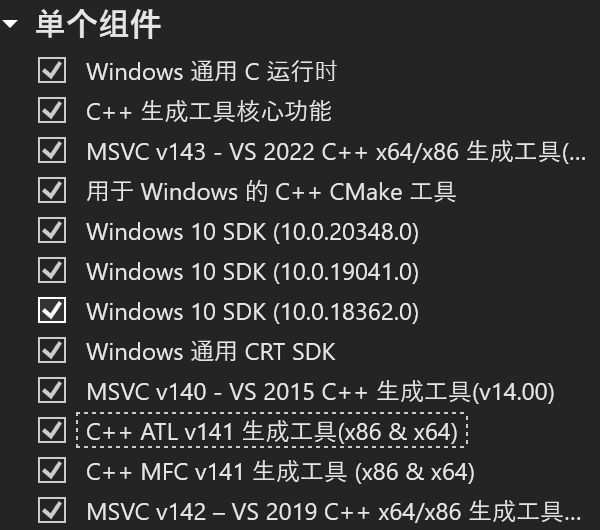

# 声纹/指令识别

- 前端
    1. https://gitee.com/gailingtuo/speech_frontend
    2. https://gitee.com/muziyuc/SpeechSimpleFrontend
- 后端
    1. https://github.com/tttungwu/Speech
    2. https://gitee.com/muziyuc/VoiceprintRecognition

## build

### 创建conda环境

```sh
conda create --name speech python=3.8
```

### 安装

#### Visual Studio Build Tools

1. 前往 [Microsoft C++ 生成工具](https://visualstudio.microsoft.com/zh-hans/visual-cpp-build-tools/)
   下载 `vsBuildTools`。
2. 建议安装以下内容：
    1. `MSVC v142 - VS 2019 C++ x64/x86 build tools` 或更新版本。
    2. `Windows 10/11 SDK`（建议安装）。
    3. CMake 以及相关支持工具。
    4. 
    5. 建议从上到下逐个安装尝试，以成功安装 `pip install webrtcvad` 为准
#### 安装依赖库

请**有序**完成下列安装步骤。

**注意**: 安装 `paddlespeech` 时可能会出现需要 `librosa==0.8.1` 的警告，这属于正常现象。

- **标准安装顺序**:

  建议更稳妥地安装各个库，可以按照以下顺序逐一执行命令：

  ```shell
  pip install paddlepaddle==2.4.1 -i https://pypi.tuna.tsinghua.edu.cn/simple
  pip install pytest-runner
  pip install paddlespeech==1.4.1 -i https://pypi.tuna.tsinghua.edu.cn/simple
  pip install librosa==0.10.1
  pip install pymilvus pymysql
  pip install transformers
  pip install sentence_transformers
  pip install LAC
  pip install noisereduce
  pip install pydub flask_cors sqlalchemy
  ```
- **简化安装**: 理论上，以下三行命令可以顺序执行完成所有依赖库的安装：

  ```shell
  pip install paddlepaddle==2.4.1 pytest-runner
  pip install paddlespeech==1.4.1
  pip install librosa==0.10.1 pymilvus pymysql transformers sentence_transformers LAC pydub noisereduce flask_cors sqlalchemy
  ```

#### 安装 PyTorch

- **Windows**:

  ```sh
  pip install torch torchvision torchaudio
  ```

- **Linux**:

  ```sh
  pip install torch torchvision torchaudio --index-url https://download.pytorch.org/whl/cpu
  ```

### 数据库配置（已部署服务器可忽略）

- 在 `config.py` 文件中配置相关内容。

#### MySQL

- 启动 MySQL 数据库：
    - `.\data` 目录位于仓库的 `database\mysql` 目录下，可以根据需要挂载到你自己的路径。

  ```shell
  cd database\mysql
  ```

  启动 MySQL 容器：

  ```sh
  docker run --privileged=true -v .\data\:/var/lib/mysql -v .\logs\:/var/log/mysql -v .\conf\:/etc/mysql -v .\my.cnf:/etc/mysql/my.cnf -p 8886:3306 --name mysql -e MYSQL_ROOT_PASSWORD=123456 -d mysql
  ```

- 可视化工具：可以使用 Navicat 等工具进行 MySQL 数据库的可视化管理。

#### Milvus

- 启动 Milvus 数据库：
    - 首先切换到 `Speech\database\milvus` 目录下，你可以看到一个 `docker-compose.yml` 文件，执行以下命令启动 Milvus：

  ```shell
  cd Speech\database\milvus
  ```

  使用 Docker Compose 启动 Milvus 容器：

  ```sh
  docker compose up -d
  ```

- 可视化工具：可以使用 [Attu](https://github.com/zilliztech/attu) 进行 Milvus 数据库的可视化管理。
